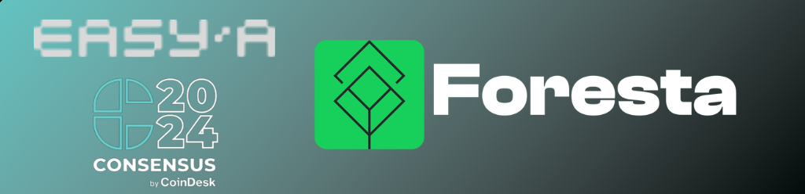
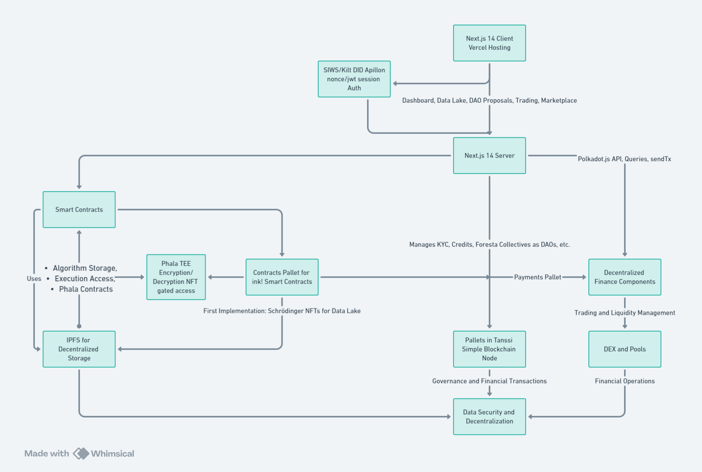
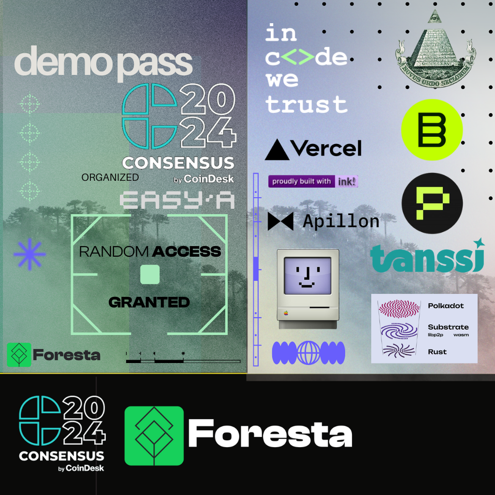

# Foresta Protocol Proof of Concept | Polkadot North America Hackathon 2024 entry

**A pioneering platform for carbon credit issuance, trading, and management, powered by blockchain technology and cutting-edge climate science.**

🌍 [Website](https://www.foresta.network) | Coming Soon

---

## Table of Contents

1. [Project Overview](#project-overview)
2. [Features](#features)
3. [Technical Documentation](#technical-documentation)
   - [Foresta Front-end Application](#foresta-front-end-application)
   - [Foresta Contracts](#foresta-contracts)
   - [Foresta Node](#foresta-node)
4. [Hackathon Highlights](#hackathon-highlights)
5. [Installation and Setup](#installation-and-setup)
6. [Contributors and Acknowledgments](#contributors-and-acknowledgments)

## Project Overview

Foresta Protocol is designed to revolutionize the way we manage, trade, and retire carbon credits using blockchain technology. This monolithic repository contains all the necessary components worked on the hackathon - from our Next.js 14 front-end applications and smart contracts to our customized blockchain node launching on Tanssi testnet, ensuring seamless integration and efficient management of carbon credit lifecycles.

Each implementation has a dedicated README with test instructions and an overall view on technical implementation.

## Features

- **Carbon Credit Lifecycle Management:** From issuance to retirement, enhanced by blockchain for transparency and security.
- **Decentralized Exchanges (DEX):** Facilitates trading of carbon credits using modern financial tools embedded within our platform.
- **KYC Integration and Governance:** Ensures compliance with global standards and enables community-driven governance through decentralized voting.
- **Secure Algorithm Execution:** Utilizes Phala Network's secure compute environments to ensure privacy and integrity in algorithm execution.
- **AI environmental auditor** An AI agent that audits carbon credit projects, providing detailed analyses and reports to increase transparency and prevent greenwashing.
- **XCM enabled - Atomic Carbon Retirements** Leverages XCM for seamless and atomic retirement of carbon credits, ensuring an efficient and secure process.
- **Stripe Payment Gateway** Integrates Stripe to facilitate easy and secure payments for carbon credits.

## Key Hacakthon Development Features

**AI Environmental Auditor**
Our AI agent, powered by Phala AI, acts as an environmental auditor for carbon credit projects listed on Foresta. The AI agent performs comprehensive audits, providing real-time analysis and reports to ensure transparency and prevent greenwashing by querying project information and collective governance information from carbon credit projects on the blockchain. This is achieved through a combination of secure data processing and advanced AI algorithms orchestration based on AI Agents compute deployment via Phala.

**Stripe Integration**
We have integrated Stripe as our payment gateway, allowing users to purchase carbon credits seamlessly. Stripe provides a secure and user-friendly interface for handling payments, ensuring a smooth transaction process for all users.

**XCM Enabled - Atomic Carbon Retirements**
Using Cross-Consensus Messaging (XCM), we enable atomic carbon credit retirements, ensuring that the retirement process is efficient and secure as 'donations'. This is based on the Sequester common-good pallet which enables any blockchain to add a fee to their own tx as an additional fee for instant carbon credit retirements from community-based natural resource management carbon projects. This feature allows for seamless interoperability between different blockchain networks creating demand for carbon credit's in a seamless fintech enabled way, providing a robust and reliable solution for managing carbon credits.

## Technical Documentation

### [Foresta Front-end Application](#foresta-front-end-application)

Built with Next.js, designed for seamless interaction with the blockchain, facilitating a robust platform for Natural Reserve's community governance, KYC verification, carbon credit trading, and Data Lake access to auditng, monitoring and verification.

[View Documentation](foresta-front-end/README.md)

### [Foresta Contracts](#foresta-contracts)

Ink! smart contracts managing Algorithm Storage NFTs (AS-NFTs) and Execution Access NFTs (EA-NFTs), enabling secure and decentralized algorithm management.

[View Documentation](rmrk-execute-compute-storage-smart-contracts/README.md)

### [Foresta Node](#foresta-node)

A Substrate-based blockchain node that supports custom pallets for carbon credits, foresta-collectives as natural reserve DAOs, KYC, payments pallet for carbon credit sales and profit-sharing, and the DEX, ensuring comprehensive management of all platform operations.

[View Documentation](tanssi-foresta-appchain-node-substrate/container-chains/templates/simple/node/README.md)

## Hackathon Highlights

During the Polkadot North America Hackathon 2024, our team focused on several key enhancements:

1. **NFT Retirements:** Automated CO2 token burns and issuance of retirement credits with certificates stored on IPFS.
2. **Foresta Collectives Pallet:** Enabled voting and management within DAO structures as Foresta Collectives.
3. **KYC Verification:** Integrated KYC Levels processes to enhance security, clearance based access to features, and future decentralized compliance around DIDs.
4. **Sign-in Options:** Implemented SIWS and Kilt DID for secure and flexible user authentication flow's.
5. **Payment Logic:** Enhanced our DEX to support transactions using USDC, USDT, and liquid carbon credits as shared revenue from these assets for Data Lake.
6. **Schrodinger NFTs:** Developed secure NFTs for managing proprietary IP in algorithms and datasets as Schrodinger NFTs.
7. **Compute-Execute Environment:** Leveraged Phala's TEE for secure execution of proprietary algorithms.
8. **Carbon Credit Trading Engine:** Enhanced trading functionalities with liquidity pools and trading platform actions.
9. **Chain-spec Launch:** Successfully launched on Tanssi's testnet, demonstrating our technology's readiness and scalability based on Tanssi's infrastructure.
10. **Marketplace:** Project submission, approval and minting from carbon credit registries on chain with marketplace pages with on-chain carbon credit projects.

## Installation and Setup

Refer to individual subdirectories for detailed installation and setup instructions:

- [Foresta Next.js 14 Front-end Application](#foresta-front-end-application)
- [Foresta Ink! Smart Contracts](#foresta-contracts)
- [Foresta Node with Contracts pallet](#foresta-node)

## Contributors and Acknowledgments

This project is made possible by the dedication and expertise of our team members and the support from the Polkadot ecosystem, particularly the insights gained from the Polkadot North America Hackathon 2024 workshops, special mentions to Josep Garcés and Kasper Mai Joergensen for their availability for mentorship sessions were we polished our final pitch. Special thanks to Encode Club, Phala Network, Shad/cn, Bitgreen, SIWS, Astar Network, Ink!athon, Apillon and Tanssi for their telegram/github/discord support and foundational technologies that will enable the next-gen of Web3 innovation and the future of Appchains on coretime.

## Project Development Branches and Transparency

To ensure complete transparency and convenience for judges and stakeholders, we outline below the key branches from our public repositories. These branches represent significant stages and features of our project development. By sharing these details, we enable the verification of Git histories to validate the continuity and integrity of our development process.

### RMRK Execute Compute Storage Smart Contracts

- **Branch: `new-architecture-integration`**
  - This branch is pivotal for integrating a new architecture inspired by the RMRK nested NFTs smart contracts, focusing on robust solutions for execution, computing, and storage needs. It forms the backbone of our secure and efficient backend logic that interacts with the blockchain.

### Foresta Tanssi Node

- **Branch: `development`**
  - Serving as the main artery for our node's development, this branch contains all the latest enhancements, including advanced functionalities for carbon credit management with our unique approach and vision.
  - [View Development Branch](https://github.com/tcxcx/tanssi-foresta/tree/development)

- **Branch: `feature/project-collective-association`**
  - Dedicated to refining the associations between conservation projects and natural reserve DAOs, this branch ensures effective management and collaboration within our platform.
  - [View Feature Branch](https://github.com/tcxcx/tanssi-foresta/tree/feature/project-collective-association)

### Foresta Front-End

- **Branch: `development`**
  - This branch hosts the ongoing enhancements to our user interface, focusing on user experience improvements, integration of new features, and ensuring the interface's performance and reliability.
  - [View Front-End Development Branch](https://github.com/tcxcx/foresta-front-end/tree/development)

The above branches have been consolidated into the present monolithic repository to streamline the review process and provide a single point of reference for all project components. This consolidation facilitates an easier and more comprehensive evaluation by judges, ensuring they can assess the full scope and scale of our project's evolution and current state with ease.

## Project Disclaimer

The architecture, business ideation, and initial pitch were extensively developed during Polkadot North America Hackathon just in May 2024. Despite the project's inception during the three-week event, significant architectural challenges were identified and subsequently addressed. The feedback and insights gained from the Hackathon were invaluable as we are currently finalists in the Smart Contract track and will be pitching live in DotSocial 2024 during Consensus 2024. This project as presented is a culmination of ongoing efforts to innovate and enhance our solutions post-Encode Hackathon with the aim of obtaining further feedback towards applying for a Web3 Foundation grant to completely decentralize the protocol as we keep innovating and exploring possibilities.

---
🌍 [Visit our website](https://www.foresta.network) | 🐦 Coming Soon |
# EasyA-Foresta
