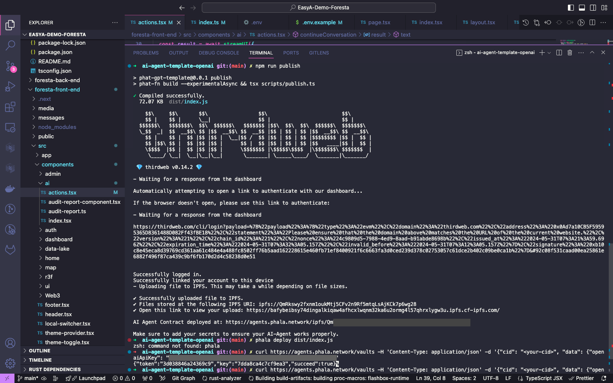
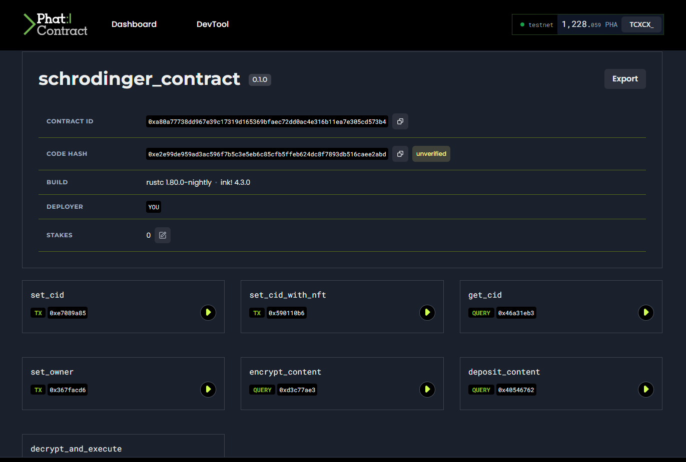

# Foresta Protocol Proof of Concept | EasyA Hackathon Polkadot entry

**A pioneering platform for carbon credit issuance, trading, and management, powered by blockchain technology and cutting-edge climate science.**

🌍 [Website](https://www.foresta.network) | Coming Soon

---

## Table of Contents

1. [Project Overview](#project-overview)
2. [Features](#features)
3. [Technical Documentation](#technical-documentation)
   - [Foresta Front-end Application](#foresta-front-end-application)
   - [Foresta Contracts](#foresta-contracts)
   - [Foresta Node](#foresta-node)
4. [Hackathon Highlights](#hackathon-highlights)
5. [Installation and Setup](#installation-and-setup)
6. [Contributors and Acknowledgments](#contributors-and-acknowledgments)

## Project Overview

Foresta Protocol is designed to revolutionize the way we manage, trade, and retire carbon credits using blockchain technology. This monolithic repository contains all the necessary components worked on the hackathon - from our Next.js 14 front-end applications and smart contracts to our customized blockchain node launching on Tanssi testnet, ensuring seamless integration and efficient management of carbon credit lifecycles.

Each implementation has a dedicated README with test instructions and an overall view on technical implementation.

## Features

- **Carbon Credit Lifecycle Management:** From issuance to retirement, enhanced by blockchain for transparency and security.
- **Decentralized Exchanges (DEX):** Facilitates trading of carbon credits using modern financial tools embedded within our platform.
- **KYC Integration and Governance:** Ensures compliance with global standards and enables community-driven governance through decentralized voting.
- **Secure Algorithm Execution:** Utilizes Phala Network's secure compute environments to ensure privacy and integrity in algorithm execution and sharing of proprietary code.
- **AI environmental auditor** An AI agent that audits carbon credit projects, providing detailed analyses and reports to increase transparency and prevent greenwashing.
- **XCM enabled - Atomic Carbon Retirements** Leverages XCM for seamless and atomic retirement of carbon credits, ensuring an efficient and secure process.

## Key Hackathon Development Features

**AI Environmental Auditor**
Our AI agent, powered by Phala AI, acts as an environmental auditor for carbon credit projects listed on Foresta. The AI agent performs comprehensive audits, providing real-time analysis and reports to ensure transparency and prevent greenwashing by querying project information and collective governance information from carbon credit projects on the blockchain. This is achieved through a combination of secure data processing and advanced AI algorithms orchestration based on AI Agents compute deployment via Phala after following thßis base tutorial and integrating to chatbot using Vercel's ai sdk 🖥️ [Website](https://docs.phala.network/ai-agent-contract/getting-started/build-your-ai-agent-contract-with-openai)
Additionaly, we implement a RAG chatbot architecture (Retrieval Augmented Generation). RAG is a powerful tool that combines the benefits of retrieval-based models and generative models. Unlike traditional chatbots that can struggle with maintaining up-to-date information or accessing domain-specific knowledge, a RAG-based chatbot uses a knowledge base created from crawled URLs to provide contextually relevant responses. We crawl project information from carbon credit projects in the foresta-node-runtime in order to get up to date information on the current state of the project, similarly, we can crawl governance info and any blockchain-based info to run our chatbot with live context data as a tool leveraging blockchain api queries.

**Compute Execution Environment with Schrodinger NFTs** 
Utilizes Phala Network's secure TEE compute environments to ensure privacy and integrity in algorithm execution by leveraging IP and 'Run Execute' NFTs for uploaded Jupyter notebooks that can be run through AWS lambda orchestrated NestJS backend infrastructure.

**Talisman Bounty**
Implemented a custom log-in user story based on Talisman's SIWS repo or 🪬 [Sign-in with Substrate repo](https://github.com/TalismanSociety/siws) with add-on such as detecting the wallet providers the user has available, secure nonce signing with JWT tokens, and a cool three JS animation and dedicated UI. The SIWS logic flow allows the application to be managing user sessions and auth entirely on the client side using api next.js server functions making a decentralized log in with substrate user story with sign ins and outs for user's session stored on the client side.

**XCM Enabled - Atomic Carbon Retirements**
Using Cross-Consensus Messaging (XCM), we enable atomic carbon credit retirements, ensuring that the retirement process is efficient and secure as 'donations'. This is based on the Sequester common-good pallet which was based on Off-chain workers but we enable it's usage through Acurast instead enablling any XCM compatible blockchain to add a fee to their own tx and business logic as an additional structure fee for instant carbon credit retirements from community-based natural resource management carbon projects. This feature allows for seamless interoperability between different blockchain networks creating demand for carbon credit's in a seamless fintech enabled way, providing a robust and reliable solution for managing carbon credits.

**Robonomics-integration experiment**
Leveraging the Robonomics platform, we created a smart contracts to manage and trigger environmental camera systems on demand. This includes the ability to turn on 'trap cameras' in natural reserves to monitor wildlife and gather environmental data. The integration allows for the collection of snapshots and small video clips which can be analyzed using AI for species identification, contributing to a decentralized science database of wildlife spottings and a climate-science verification method for biodiversity. This approach enhances transparency and real-time monitoring capabilities for environmental projects.

## Technical Documentation

### [Foresta Front-end Application](#foresta-front-end-application)

Built with Next.js, designed for seamless interaction with the blockchain, facilitating a robust platform for Natural Reserve's community governance, KYC verification, carbon credit trading, and Data Lake access to auditing, monitoring and verification.

[View Documentation](foresta-front-end/README.md)

### [Foresta Contracts](#foresta-contracts)

Ink! smart contracts managing Algorithm Storage NFTs (AS-NFTs) and Execution Access NFTs (EA-NFTs), enabling secure and decentralized algorithm management. Ink Robonomics smart contract included in separate folder.

[View Documentation](rmrk-execute-compute-storage-smart-contracts/README.md)

### [Foresta Node](#foresta-node)

A Substrate-based blockchain node that supports custom pallets for carbon credits, foresta-collectives as natural reserve DAOs, KYC, payments pallet for carbon credit sales and profit-sharing, and the DEX, ensuring comprehensive management of all platform operations.

[Node Interaction Instructions](foresta-front-end/instructions-node-interactions.txt).

[View Documentation](tanssi-foresta-appchain-node-substrate/container-chains/templates/simple/node/README.md)

## Installation and Setup

Refer to individual subdirectories for detailed installation and setup instructions:

- [Foresta Next.js 14 Front-end Application](#foresta-front-end-application)
- [Foresta Ink! Smart Contracts](#foresta-contracts)
- [Foresta Node with Contracts pallet](#foresta-node)

## Contributors and Acknowledgments

This project is made possible by the dedication and expertise of our team members and the support from the Polkadot ecosystem, particularly the insights gained from the Polkadot North America Hackathon 2024 workshops and the IRL EasyA Hackathon happening in parallel during Consensus 2024. Special thanks to The Blockspace HQs, Web Zero DevRel team, Phala Network, Shad/cn, Bitgreen, SIWS, Astar Network, Ink!athon, Apillon,the one and only Talisman, Vercel, basement studio and Tanssi <3 for their telegram/github/discord support and foundational technologies and advice that will enable the next-gen of Web3 innovation and the future of Appchains on coretime.

## Project Disclaimer

The architecture, business ideation, and initial pitch were extensively developed during Polkadot North America Hackathon just in May 2024. Despite the project's inception during the four-week event, significant architectural challenges were identified and subsequently addressed. The feedback and insights gained from the Hackathon were invaluable as we are currently finalists in the Smart Contract track and will be pitching live in DotSocial 2024 during Consensus 2024. This project as presented is a culmination of ongoing efforts to innovate and enhance our solutions post-Hackathon with the aim of obtaining further feedback towards applying for a Web3 Foundation grant to completely decentralize the protocol as we keep innovating and exploring possibilities for carbon credit at the intersection of ReFi + RWA + DeSci.

---
🌍 [Visit our website](https://www.foresta.network) | 🐦 Coming Soon |
# EasyA-Foresta
